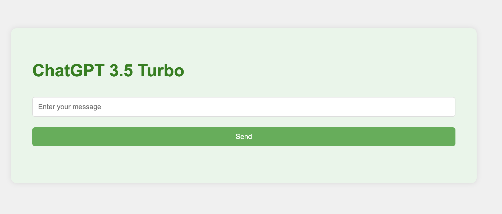

ChatGPT-local-ssh

This repository provides SSH execution access to chatGPT, allowing users to bypass IP restrictions and connect with other VPNs and proxies. It enables unrestricted usage of chatGPT, while also enhancing privacy and providing access to additional network resources. The supported version of chatGPT is 3.5.

To get started, follow these steps:

1. Copy the server code to your remote machine.
2. Install golang.
3. Change the value of `apiKey` variable to your API key in the `main.go` file.
4. Build the code using `go build` command.
5. Copy the built file to a desired path and remember the path.

On your local machine, perform the following steps:

1. Clone this project to your local machine.
2. Install golang.
3. Install Docker.
4. Make sure you have the following files in the `local/ssh` directory: `id_rsa`, `id_rsa.pub`, and `known_hosts`.
5. Modify the `main.go` file by replacing "USER@IP" with your username and IP address of the server, and change the path of the built file to `/root/chatgpt/main`.
6. Build the local Docker image using the command `docker-compose up --build`.
7. Run the Docker container using the command `docker-compose up -d`.
8. To check the logs, use the command `docker-compose logs -f`.

To send requests to the API, follow the steps below:
1. Make sure you have the API running on your local machine.
2. Access the address `localhost:9999/` on your preferred tool (e.g., cURL).
3. Send a POST request to the address with the following parameters:
- Header: Content-Type: application/json
- Body: {"message": "Hello, world!"}

Below is an example of using cURL to send the request:
```bash
curl --location localhost:9999 \
--header "Content-Type: application/json" \
--request POST \
--data '{"message": "Hello, world!"}'
```

Remember to adjust the address (`localhost:9999`) and the request body (`{"message": "Hello, world!"}`) according to your specific API setup.



Now you have set up the ChatGPT SSH access locally with the ability to utilize VPNs, proxies, enhanced privacy, and access to additional network resources. Enjoy the unrestricted usage of chatGPT!